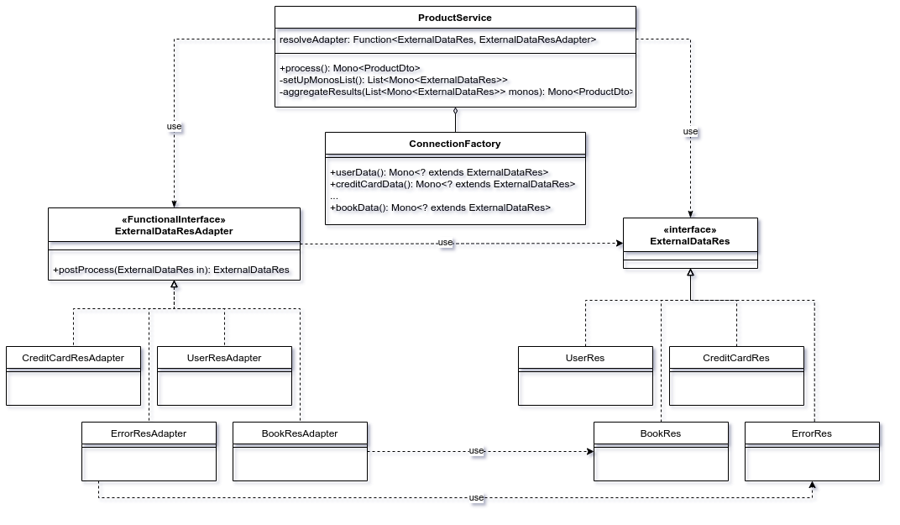

# WebFlux With Several Data-Sources Example

## News
2021-09-27: Error processing updated with Errors instance aggregated in all XxRes classes

2021-09-23: Blocking barrier changed on favor of Mono.zip and correct error processing (for Book entity only)

## About
Usually in standard web applications we are working with one data-source. It can be a database, or queue, or even file storage. But what should we do if we are receiving data from several data sources? If it’ll be two different databases or two other services from which data flow into a product, it can be called step-by-step:
```java
Result1 result1 = datasource1.call();
Result2 result2 = datasource2.call();
```
If we don’t want to be blocked on datasource1, a job can be written and something like ThreadExecutor and Fork/Join framework will be used for managing results. But what should we do if we're having 10 different RESTful web-services with different API, different responses, different auth methods, etc.? And more importantly, what should we do if the count of these services will grow in the future? How to treat them in the same manner and call them asynchronously and just wait while all answers/errors/timeout will be available?

When I’ve started solving this problem for one of my clients, I’ve decided that WebFlux and [Project Reactor](https://projectreactor.io/) are mature enough and it can help me with it. But soon my code starts looking like this:
```java
WebClient client1 = WebClient.create("http://book-service.com:3003");
Mono<BookRes> monoOfBook =     client1.get().uri("/book").retrieve().bodyToMono(BookRes.class)
        .timeout(Duration.ofMillis(1000L)).subscribeOn(
            Schedulers.elastic());

WebClient client2 = WebClient.create("http://author-service.com:3002");
Mono<AuthorRes> monoOfAuthor =     client2.get().uri("/author").retrieve().bodyToMono(AuthorRes.class)
        .timeout(Duration.ofMillis(1000L)).subscribeOn(
            Schedulers.elastic());
...

monoOfBook.subscribe()....
monoOfAuthor.subscribe()....
...
```
Pretty ugly, yeh?!

So, I’ve started working on POC which should help me to add new datasource to a project in a more or less simple way. It was obvious to me that I should create as many “connections” (in my case it were RESTful API) as I need, then call them in one loop and wait while all of them will produce results or errors. I needed a list of Mono, but all of them had different types. So it could looks like this:
```java
List<Mono<Object>> monos …
monos.add(monoOfBook);
monos.add(monoOfAuthor);
…
```
It looks like I need something common for Mono<AuthorRes> & Mono<BookRes> & etc. This is how the marker interface [ExternalDataRes](https://github.com/viacheslavyakovenko/webflux-with-several-datasources/blob/main/src/main/java/com/wfwsds/model/ExternalDataRes.java) appeared.

It helps me to work with all responses from different data-sources in a common style. So, pretty soon a connections factory appeared in my code [ConnectionFactory](https://github.com/viacheslavyakovenko/webflux-with-several-datasources/blob/main/src/main/java/com/wfwsds/util/ConnectionFactory.java) , which help me to achieve needed list of Monos easily.

So, preparing a list of connections for parallel call will look like this:
```java
    List<Mono<ExternalDataRes>> monos = new ArrayList<>();

    monos.add((Mono<ExternalDataRes>) connectionFactory
        .postUserData(new UserReq("100500", "testName", "testLastName")));
    monos.add((Mono<ExternalDataRes>) connectionFactory.statisticData());
    monos.add((Mono<ExternalDataRes>) connectionFactory.creditCardData());
    monos.add((Mono<ExternalDataRes>) connectionFactory.bookData());
```
The next issue which I needed to solve was a dilemma: how to organize post-processing of each response in a different manner. Just imagine that for UserRes we need to convert first name and last name to uppercase, but for CreditCardRes we need to hide the first 12 digits of the card number!? As we are planning to treat all responses in a single loop, we’ll lose their types and we’ll work with ExternalDataRes in each step. Of course we can place handler code in the postProcess() method of ExternalDataRes and overload it in each implementation. But in this case we’ll break the [Single Responsibility Principle](https://en.wikipedia.org/wiki/Single-responsibility_principle). It looks like we need something like [Visitor pattern](https://en.wikipedia.org/wiki/Visitor_pattern) implementation :) .

So, one of the possible solution will be depict on the following class diagram:


Here you can see the data model object hierarchy with ExternalDataRes marker interface on the top. And the set of the strategies with the @FunctionalInterface ExternalDataResAdapter on its top too. In my example we’ll have a convention that each SomeNameRes will have a SomeNameAdapter which will know how to post-process its “own” data object.
UserRes -> UserResAdapter, CreditCardRes -> CreditCardResAdapter, etc.

So, if we’ll need to add an NewOne external data RESTful API to our product, we’ll just need to follow the next steps:
Create NewOneRes class, which will represent NewOne response data structure from the corresponding API;
Add method to our ConnectionFactory which will return Mono<? extends ExternalDataRes> configured by WebClient lookin on NewOne API;
Create an implementation of the NewOneResAdapter;
Modify setUpMonosList() in our service layer - we need to add our NewOne Mono<? extends ExternalDataRes> to the list.
That’s all, it should work now.

Only one “magic” still not covered by this article yet, how will our NewOneResAdapter know that it should process NewOneRes when it appears in one of the mono from the the list?

That’s pretty easy! As a naming agreement was discussed previously, it can be encoded like this:
```java
Function<ExternalDataRes, ExternalDataResAdapter> resolveAdapter =
v -> ((ExternalDataResAdapter) context.getBean(v.getClass().getSimpleName() + “Adapter”));
```
And yes, you can use your own [strategy](https://en.wikipedia.org/wiki/Strategy_pattern) of adapter resolving, as this one is just the simplest possible one.


## How-to run this example
1. Install https://mockoon.com/
2. GoTo src/main/resources/datasources.json and import it to Mockoon
3. Run all environments in the Mockoon
4. Run   @Test
         public void tesProductDto() {
5. Start experimenting

Enjoy